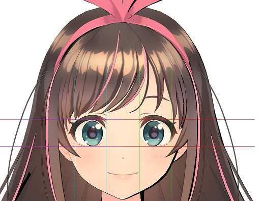

# cg2021f-hw02

## 自評表

 - [x] 視角可以移動及放大
 - [x] 在畫面上畫出左眼的邊框
 - [x] 複製左眼邊框變化到右眼
 - [x] 按鍵選擇上 / 下一隻角色 (A/D)
 - [x] 可儲存座標點檔案
 - [x] 回答問題

## demo


## install the dev server
``` bash 
npm install 
```

## run the dev server
``` bash
npm run dev
```